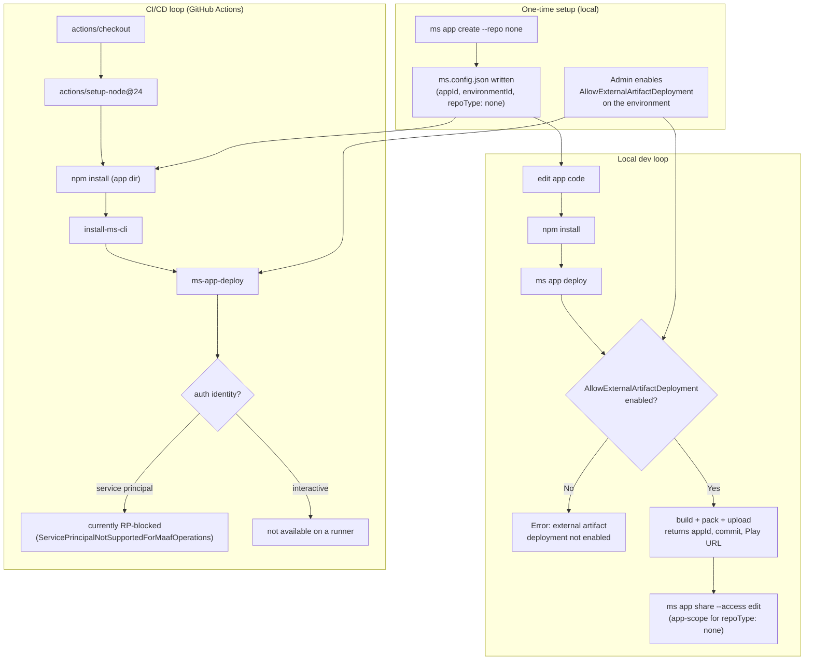
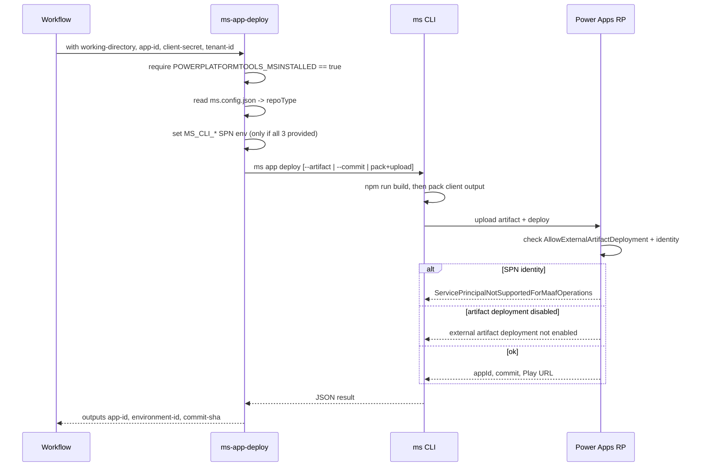
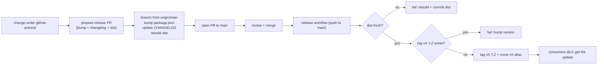

# Managed Apps GitHub Actions — Architecture & Flow

How the actions under `github-actions/` fit into the end-to-end MAAF lifecycle:
one-time app setup, the local dev loop, the CI/CD deploy loop, and how this repo
releases the actions themselves. Diagrams are Mermaid (render on GitHub).

## Components

| Piece | Role |
|---|---|
| `ms` CLI (`@microsoft/managed-apps-cli`) | Does the real work: scaffolds, builds, packs, uploads, deploys, shares. |
| `install-ms-cli` action | Installs the `ms` CLI on the runner. |
| `ms-app-pack` action | Wraps `ms app pack` (build + stage artifact). Optional — deploy can pack internally. |
| `ms-app-deploy` action | Wraps `ms app deploy` (build + pack + upload + deploy). |
| `ms.config.json` | Per-app config (`appId`, `environmentId`, `repoType`) written by `ms app create`. |
| Power Platform environment | Deploy target; needs `AllowExternalArtifactDeployment` enabled for BYOB (`repoType: none`) deploys. |
| Release workflow + [release guide](release-guide.md) | Versions and publishes the actions (this repo). |

## 1. End-to-end activity flow

Three phases: one-time setup (local), then either the local dev loop or the CI
loop reuse the same `ms.config.json` + environment.



## 2. Inside `ms-app-deploy`

What the deploy action does on each run, and where the Resource Provider (RP)
can reject it.



Deploy mode is chosen from `repoType` + inputs:

| `repoType` | input | CLI call |
|---|---|---|
| `none` | `artifact-path` | `ms app deploy --artifact <zip>` |
| `none` | (none) | `ms app deploy` (CLI packs + uploads) |
| `native` / `github` | `commit-sha` (or `GITHUB_SHA`) | `ms app deploy --commit <sha>` |

## 3. Release & versioning flow (this repo)

How a change to the actions becomes a `@v1` update consumers receive.



- `package.json` version is the single source of truth (`vMAJOR.MINOR.PATCH`).
- `v1` (moving) is what consumers pin; `vX.Y.Z` (immutable) is the rollback point.
- A major bump produces a fresh `vN` alias and leaves older majors untouched.

## Prerequisites & gotchas (from real testing)

- **`AllowExternalArtifactDeployment` must be enabled** on the target environment
  for `repoType: none` (BYOB) deploys. Observed: `ms app deploy` failed twice with
  *"External artifact deployment is not enabled for this environment"* until an
  admin enabled it, then succeeded and returned the appId / commit / Play URL.
- **`repoType: none` needs no git remote.** `ms app create --repo none` scaffolds
  from a template and writes `ms.config.json`; deploy builds locally and uploads
  the artifact. No `git init`/remote required.
- **Cloud target** is set via `MS_CLI_CLOUD_INSTANCE` (tested `preprod`). The
  `ms-app-deploy` action exposes this as the `cloud` input.
- **Auth:** interactive sign-in (`ms auth login`) works for local dev. Service
  principal auth is wired in the actions but **currently rejected by the RP** for
  MAAF operations — so a CI deploy can't authenticate yet. This is a platform
  limitation, not an action bug.
- **Sharing:** for `repoType: none` apps (no platform-managed repo),
  `ms app share <id> --access edit` grants contributor access at the **app scope**
  rather than the repository scope.
- **Debug env override:** `MS_CLI_MAAF_DEBUG_ENVIRONMENT_ID` was used in testing to
  target a specific environment id.

### Example (validated, non-Dataverse preprod)

```pwsh
$Env:MS_CLI_MAAF_DEBUG_ENVIRONMENT_ID = '<environment-guid>'
$Env:MS_CLI_CLOUD_INSTANCE = 'preprod'
ms app create --display-name "Non DV test" --repo "none"
npm install
ms app deploy            # succeeds once AllowExternalArtifactDeployment is on
ms auth login
ms app share <app-id> --access edit
```
